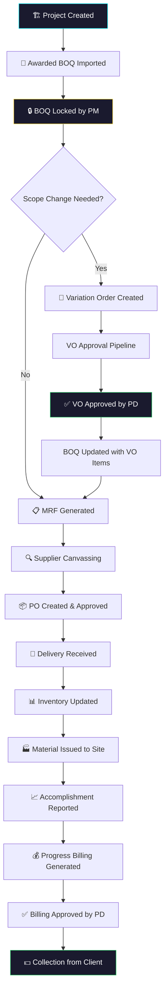
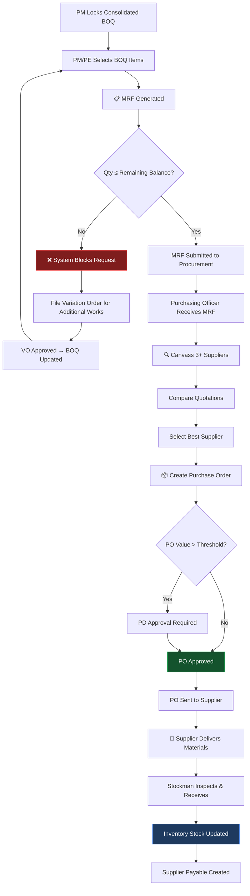
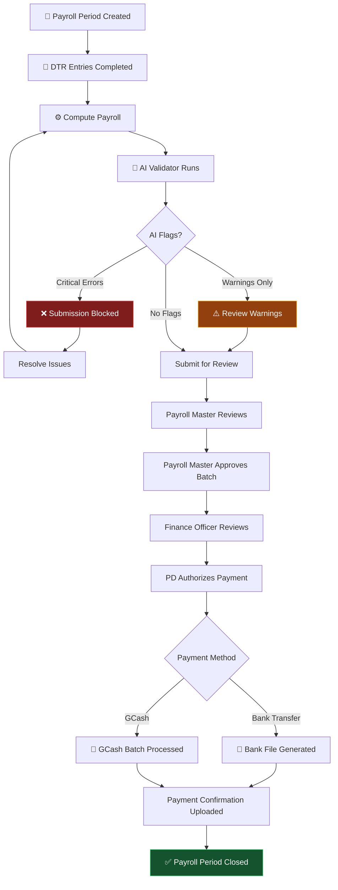
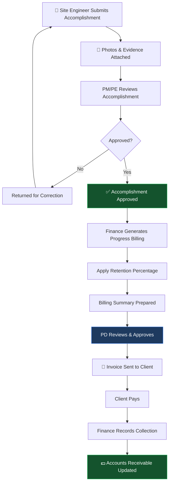
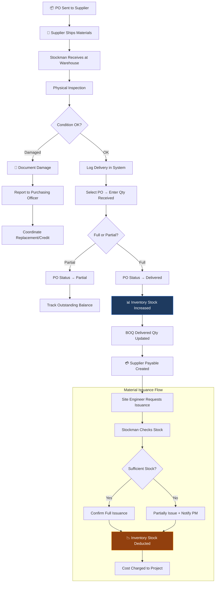
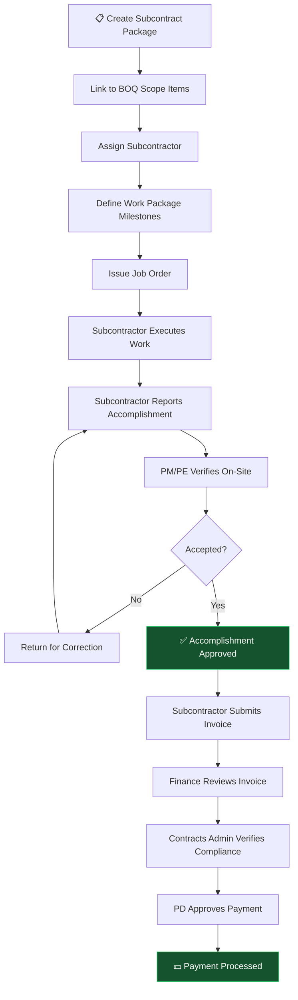
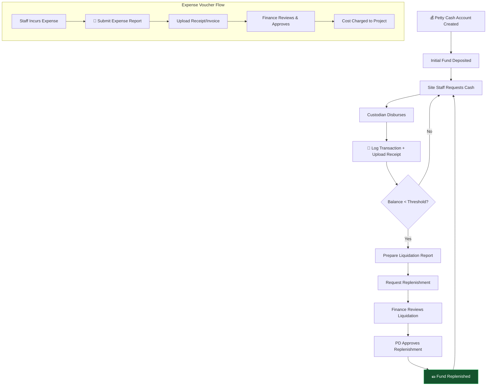
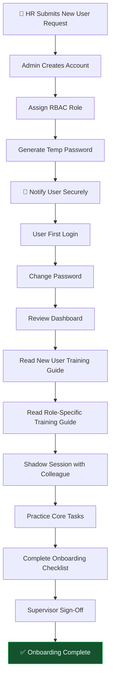
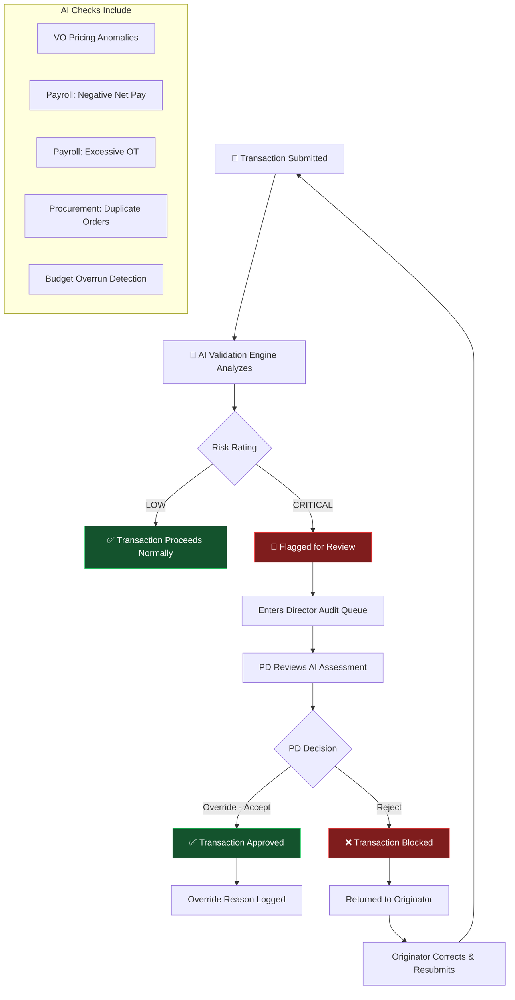

# OneSystemsERP — Workflow Charts

**Document Code:** WFC-001  
**Version:** 1.0  
**Classification:** Internal — All Staff  
**Effective Date:** June 2026  

---

## 📋 Table of Workflow Charts

1. [Master ERP Workflow Overview](#1-master-erp-workflow-overview)
2. [Procurement Workflow](#2-procurement-workflow)
3. [Variation Order Approval Pipeline](#3-variation-order-approval-pipeline)
4. [Payroll Processing Workflow](#4-payroll-processing-workflow)
5. [Progress Billing Workflow](#5-progress-billing-workflow)
6. [Delivery & Inventory Workflow](#6-delivery--inventory-workflow)
7. [Subcontracting Workflow](#7-subcontracting-workflow)
8. [Petty Cash & Expense Workflow](#8-petty-cash--expense-workflow)
9. [User Onboarding Workflow](#9-user-onboarding-workflow)
10. [AI Validation & Override Workflow](#10-ai-validation--override-workflow)

---

## 1. Master ERP Workflow Overview



**Key Principle:** Every transaction in OneSystemsERP is traceable back to the BOQ baseline. No material can be procured, no billing can be generated, and no cost can be charged without a valid BOQ reference.

---

## 2. Procurement Workflow



**Roles Involved:**
| Step | Role |
|------|------|
| Lock BOQ | Project Manager |
| Generate MRF | PM / PE / Purchasing Officer |
| Canvass Suppliers | Purchasing Officer |
| Create PO | Purchasing Officer |
| Approve PO | Project Director |
| Receive Delivery | Stockman |
| Inspect Quality | Materials Engineer |

---

## 3. Variation Order Approval Pipeline

```mermaid
flowchart LR
    A["📝 DRAFT"] --> B["📤 SUBMITTED"]
    B --> C["💰 FOR COSTING"]
    C --> D["👷 PM REVIEW"]
    D --> E["💵 FINANCE REVIEW"]
    E --> F["👑 PD APPROVAL"]
    F --> G{"Decision"}
    G -->|Approved| H["✅ APPROVED"]
    G -->|Rejected| I["❌ REJECTED"]
    H --> J["Revised Contract Updated"]
    J --> K["New Items Injected into BOQ"]
    K --> L["Items Tagged with ⚡ New via VO"]
    I --> A

    style A fill:#374151,stroke:#9ca3af,color:#fff
    style C fill:#7c3aed,stroke:#a78bfa,color:#fff
    style D fill:#2563eb,stroke:#60a5fa,color:#fff
    style E fill:#d97706,stroke:#fbbf24,color:#fff
    style F fill:#dc2626,stroke:#f87171,color:#fff
    style H fill:#16a34a,stroke:#4ade80,color:#fff
    style I fill:#7f1d1d,stroke:#ef4444,color:#fff
```



**Stage Details:**

| Stage | Responsible | Action |
|-------|-------------|--------|
| Draft | PM / Contracts Admin | Create VO with justification and BOQ items |
| For Costing | Cost Officer | Verify unit costs and financial calculations |
| PM Review | Project Manager | Review scope impact and recommend |
| Finance Review | Finance Officer | Verify budget availability and financial viability |
| PD Approval | Project Director | Final approval — permanently updates contract |

**AI Validation:** The AI engine assigns a Risk Rating (`CRITICAL` or `LOW`) before PD review.

---

## 4. Payroll Processing Workflow



**Computation Formula Summary:**

| Component | Formula |
|-----------|---------|
| Gross Pay | Basic Pay + Overtime Pay + Allowances |
| Overtime | OT Hours × Hourly Rate × 1.25 |
| SSS | 4.5% of Gross |
| PhilHealth | Gross × PH Rate |
| Pag-IBIG | Gross × Rate (max ₱200/month) |
| Net Pay | Gross − Gov Deductions − Tax − Ledger Deductions |

**AI Critical Blocks:** Net Pay ≤ 0 | Deductions ≥ 60% of Gross

---

## 5. Progress Billing Workflow



**Billing Formula:**
```
Current Billing = (Cumulative Accomplishment × Unit Price) − Previous Billings
Net Billing = Current Billing − Retention (typically 10%)
```

---

## 6. Delivery & Inventory Workflow



---

## 7. Subcontracting Workflow



---

## 8. Petty Cash & Expense Workflow



---

## 9. User Onboarding Workflow



---

## 10. AI Validation & Override Workflow



---

**Workflow Charts — End of Document**  
*OneSystemsERP Training & Operations Package*  
*Document Code: WFC-001 | Version 1.0*
